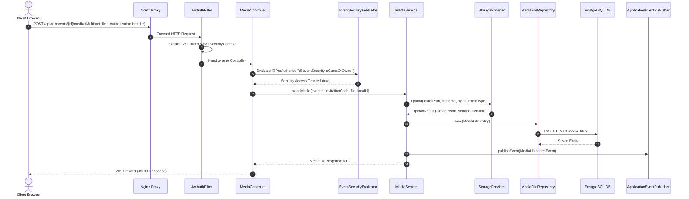

# REST API Processing Flow & Endpoint Catalog

## 1. End-to-End Request Pipeline

Every incoming REST API request undergoes a structured filter chain and security evaluation before reaching the business service layer:

```
[HTTP Request from React SPA / Axios]
         │
         ▼
[Nginx Reverse Proxy] ── (TLS Termination, Rate Limiting)
         │
         ▼
[CorrelationIdFilter] ── (Extracts/Generates X-Correlation-ID, Injects into SLF4J MDC)
         │
         ▼
[RateLimitingFilter] ── (Enforces Bucket4j IP Rate Limits for Public Endpoints)
         │
         ▼
[JwtAuthenticationFilter] ── (Validates Bearer Token, Sets SecurityContext Authentication)
         │
         ▼
[Spring Security Filter Chain] ── (Evaluates permitAll vs authenticated rules)
         │
         ▼
[Controller Layer] ── (Validates DTO constraints @Valid, extracts path/query params)
         │
         ▼
[EventSecurityEvaluator] ── (@PreAuthorize("@eventSecurity.isOwner(#id)"))
         │
         ▼
[Service Layer] ── (@Transactional Business Logic execution & Validation)
         │
         ▼
[Repository Layer] ── (Spring Data JPA SQL execution on PostgreSQL)
         │
         ▼
[Domain Event Publisher] ── (Publishes event for AFTER_COMMIT listeners)
         │
         ▼
[HTTP Response (200/201/400/401/403/404/500)]
```

---

## 2. Request-Response Sequence Diagram



---

## 3. Complete REST API Endpoint Catalog

### Authentication Endpoints (`/api/v1/auth`)
| Method | Endpoint | Access Level | Description |
|---|---|---|---|
| `POST` | `/api/v1/auth/google` | Public | Authenticates via Google ID Token, registers or retrieves user, returns JWT Access/Refresh tokens. |
| `POST` | `/api/v1/auth/refresh` | Public | Issues a new Access Token using a valid Refresh Token. |
| `POST` | `/api/v1/auth/verify-mobile` | Authenticated | Verifies user's mobile phone number with OTP code. |
| `POST` | `/api/v1/auth/logout` | Authenticated | Revokes active refresh token and clears session. |

### Event Management Endpoints (`/api/v1/events`)
| Method | Endpoint | Access Level | Description |
|---|---|---|---|
| `POST` | `/api/v1/events` | Authenticated (`OWNER`/`ADMIN`) | Creates a new event wizard draft. |
| `GET` | `/api/v1/events` | Authenticated (`OWNER`/`ADMIN`) | Lists events owned by current user. |
| `GET` | `/api/v1/events/{id}` | `@eventSecurity.isOwner(#id)` | Retrieves full event details, settings, and quota usage. |
| `PUT` | `/api/v1/events/{id}` | `@eventSecurity.isOwner(#id)` | Updates event parameters (title, date, location, theme). |
| `POST` | `/api/v1/events/{id}/publish` | `@eventSecurity.isOwner(#id)` | Transitions event status to `PUBLISHED`. |
| `GET` | `/api/v1/events/slug/{slug}` | Public | Looks up basic event metadata by public URL slug. |

### Public Invitation Endpoints (`/api/v1/invite`)
| Method | Endpoint | Access Level | Description |
|---|---|---|---|
| `GET` | `/api/v1/invite/{slug}` | Public | Loads public invitation landing card, event theme, countdown, and guest context. |

### RSVP & Guest Endpoints (`/api/v1/events/{id}/rsvp`, `/api/v1/events/{id}/guests`)
| Method | Endpoint | Access Level | Description |
|---|---|---|---|
| `POST` | `/api/v1/events/{id}/rsvp` | Public | Submits guest attendance RSVP, plus-ones, and dietary requirements. |
| `GET` | `/api/v1/events/{id}/rsvp/summary` | `@eventSecurity.isOwner(#id)` | Retrieves aggregated RSVP statistics (ATTENDING, DECLINED, PENDING). |
| `POST` | `/api/v1/events/{id}/guests` | `@eventSecurity.isOwner(#id)` | Adds a new guest manually to the guest list. |
| `POST` | `/api/v1/events/{id}/guests/import` | `@eventSecurity.isOwner(#id)` | Bulk imports guest lists via CSV file. |
| `GET` | `/api/v1/events/{id}/guests` | `@eventSecurity.isOwner(#id)` | Retrieves paginated guest list with invitation status. |

### Media Endpoints (`/api/v1/events/{id}/media`)
| Method | Endpoint | Access Level | Description |
|---|---|---|---|
| `POST` | `/api/v1/events/{id}/media` | Public / Guest | Uploads photo/video for an event with MIME & size validation. |
| `GET` | `/api/v1/events/{id}/media` | Public | Retrieves paginated public event media gallery. |
| `POST` | `/api/v1/events/{id}/media/sync` | Public / Guest | Idempotent offline upload queue synchronization endpoint. |
| `DELETE` | `/api/v1/events/{id}/media/{mediaId}` | `@eventSecurity.isOwner(#id)` | Deletes media file from storage and database. |

### Payment Endpoints (`/api/v1/payments`)
| Method | Endpoint | Access Level | Description |
|---|---|---|---|
| `GET` | `/api/v1/payments/packages` | Authenticated | Retrieves available package tiers and prices. |
| `POST` | `/api/v1/payments` | Authenticated (`OWNER`) | Submits package upgrade payment with Instapay/Vodafone Cash receipt upload. |
| `GET` | `/api/v1/payments/my-payments` | Authenticated (`OWNER`) | Retrieves payment history for the logged-in owner. |

### Admin Endpoints (`/api/v1/admin`)
| Method | Endpoint | Access Level | Description |
|---|---|---|---|
| `GET` | `/api/v1/admin/dashboard` | `hasRole('ADMIN')` | Returns overall platform metrics (users, events, revenue, storage). |
| `GET` | `/api/v1/admin/payments/pending` | `hasRole('ADMIN')` | Lists submitted payments waiting for approval. |
| `POST` | `/api/v1/admin/payments/{id}/review` | `hasRole('ADMIN')` | Approves or rejects payment receipt, triggering package activation. |
| `GET` | `/api/v1/admin/feature-flags` | `hasRole('ADMIN')` | Lists runtime feature flags. |
| `PUT` | `/api/v1/admin/feature-flags/{key}` | `hasRole('ADMIN')` | Toggles dynamic runtime feature flag state. |
