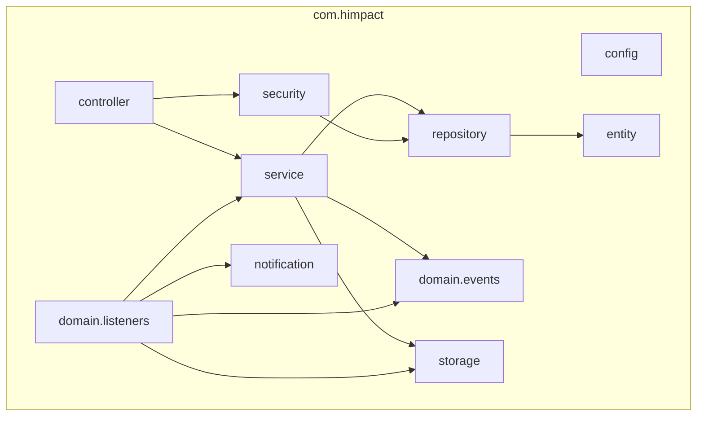
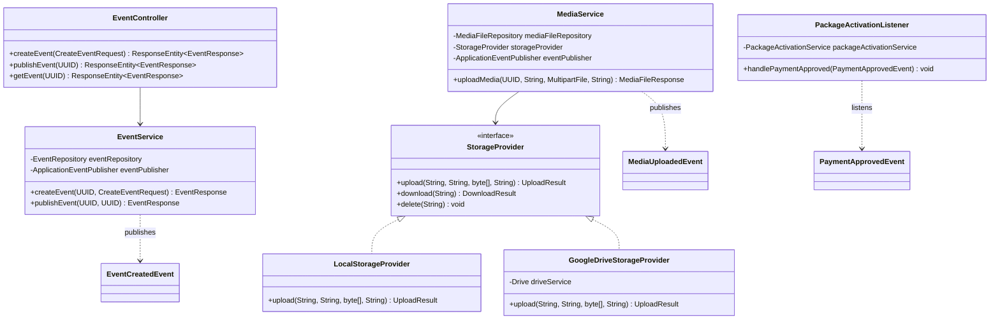

# Backend Class & Package Map

## 1. Package Map & Architectural Demarcation

The backend application package structure is organized under `com.himpact`:

```
com.himpact
├── HimpactApplication.java          # Spring Boot Main Entry Point
├── config/                          # Security, OpenAPI, Async & Property Configurations
├── controller/                      # REST API Endpoints & Request/Response Mappings
├── service/                         # Business Domain Logic & Transaction Boundaries
├── repository/                      # Spring Data JPA Data Access Repositories
├── entity/                          # JPA Database Domain Entities & Enums
├── domain/
│   ├── events/                      # Application Domain Event Records
│   └── listeners/                   # Asynchronous Domain Event Listeners
├── security/                        # Jwt Filters, Principal, Evaluators, Rate Limiting
├── storage/                         # Local & Google Drive Storage Providers & Models
├── notification/
│   └── provider/                    # Email, SMS, WhatsApp & Push Notification Providers
├── dto/                             # Data Transfer Objects & Request Specs
├── exception/                       # Custom Global Exceptions & Handlers
└── util/                            # Utility Helpers (Slug, QR Code, Hash)
```

---

## 2. Comprehensive Class Catalog

### Controllers (`com.himpact.controller`)
- `AdminController`: Operations for system admins (`/api/v1/admin`), dashboard statistics, payment approvals, and feature flag management.
- `AuthController`: Google OAuth2 authentication (`/api/v1/auth/google`), token refresh (`/api/v1/auth/refresh`), mobile verification, and logout.
- `EventController`: CRUD for events (`/api/v1/events`), publishing, slug lookup, and dashboard summary.
- `GuestController`: Guest list management, CSV import, manual addition, RSVP invitation link generation, and single guest lookups.
- `InvitationController`: Public guest invitation loading (`/api/v1/invite/{slug}`), verification, and guest context lookup.
- `MediaController`: Photo & video upload handling (`/api/v1/events/{id}/media`), paginated gallery retrieval, offline sync initialization, and media deletion.
- `PaymentController`: Package pricing listing, payment submission with receipt uploads (`/api/v1/payments`), and owner payment history.
- `RsvpController`: Guest RSVP submission (`/api/v1/events/{id}/rsvp`) and RSVP summary retrieval.
- `CommentController`: Guest wall comments (`/api/v1/events/{id}/comments`), message submission, and comment listing.

### Services (`com.himpact.service`)
- `AuthService`: Google ID token verification via `GoogleIdTokenVerifier`, user registration, JWT generation, and token refresh.
- `EventService`: Event creation, slug generation, owner quota verification, event publishing, and event deletion.
- `GuestService`: Bulk guest management, invitation code assignment (`UUID`/nano ID), RSVP status updating, and upload limit management.
- `MediaService`: Multipart file validation (size/MIME), storage execution, database persistence, transaction-rollback file cleanup, and offline queue deduplication.
- `PaymentService`: Payment submission, receipt storage, state transition handling (`SUBMITTED` -> `APPROVED` / `REJECTED`), and domain event publishing.
- `PackageActivationService`: Decoupled event package quota activation (increasing upload limit, guest limit, and storage capacity).
- `InvitationService`: Public invitation landing page data construction, theme resolution, and RSVP state lookup.
- `RsvpService`: Guest RSVP persistence, dietary requirements handling, plus-one tracking, and owner notification triggering.
- `CommentService`: Moderated guest wall comment submission and retrieval.
- `AnalyticsService`: Event metrics aggregation, guest response rates, and media storage usage statistics.
- `AuditLogService`: Security and operational audit log entry persistence.
- `FeatureFlagService`: Dynamic runtime feature toggling (`FeatureFlag` DB table lookup).
- `NotificationService`: Dispatching notifications across multi-channel providers (`Email`, `SMS`, `WhatsApp`, `Push`).
- `QrCodeService`: QR Code image generation (ZXing) embedding public invitation URLs.
- `RefreshTokenService`: Refresh token creation, database persistence, expiration verification, and revocation.
- `AdminService`: Dashboard metrics aggregation, user management, and system configuration overrides.

### Domain Events & Listeners (`com.himpact.domain.*`)
- **Events**: `EventCreatedEvent`, `EventPublishedEvent`, `GuestAddedEvent`, `InvitationViewedEvent`, `RSVPSubmittedEvent`, `CommentAddedEvent`, `MediaUploadedEvent`, `PaymentApprovedEvent`.
- **Listeners**:
  - `AnalyticsListener`: `@TransactionalEventListener(phase = AFTER_COMMIT)` for metrics tracking.
  - `AuditListener`: Audit log recording post-transaction commit.
  - `NotificationListener`: Queueing emails, push notifications, and SMS messages post-transaction commit.
  - `PackageActivationListener`: Triggers `PackageActivationService` upon `PaymentApprovedEvent`.
  - `StorageListener`: Provisions event storage folders upon `EventPublishedEvent`.

### Security Components (`com.himpact.security`)
- `SecurityConfig`: Spring Security 6.x security filter chain, CORS configuration, CSP headers, HSTS, session state policy (`STATELESS`).
- `JwtTokenProvider`: JJWT token building, signing with HMAC-SHA256, claim extraction, and expiration validation.
- `JwtAuthenticationFilter`: Request header `Authorization: Bearer <token>` parsing, security context population.
- `EventSecurityEvaluator`: SpEL expressions (`@eventSecurity.isOwner(#eventId)` & `@eventSecurity.isGuestOrOwner(#eventId)`) enforcing event data isolation.
- `CorrelationIdFilter`: MDC correlation ID injection for request tracing.
- `RateLimitingFilter`: Bucket4j IP rate limiting filter for public endpoints.
- `HimpactUserPrincipal`: Custom `UserDetails` / `Principal` object holding `userId`, `email`, `role`, and `mobileVerified`.
- `LoginAttemptService`: Brute-force protection tracking failed login attempts.

### Storage Providers (`com.himpact.storage`)
- `StorageProvider`: Base interface defining `upload`, `download`, `delete`, `exists`, `getProviderName`.
- `DriveProvider`: Interface extension specific to cloud drive operations (`uploadFile`, `downloadFile`, `deleteFile`, `fileExists`).
- `LocalStorageProvider`: Implementation persisting files to local disk under `uploads/`.
- `GoogleDriveStorageProvider`: Implementation integrating with Google Drive API v3 via Google Service Account credentials, featuring exponential backoff retries.

---

## 3. Package & Class Diagrams

### Package Diagram



### Core Backend Class Diagram


