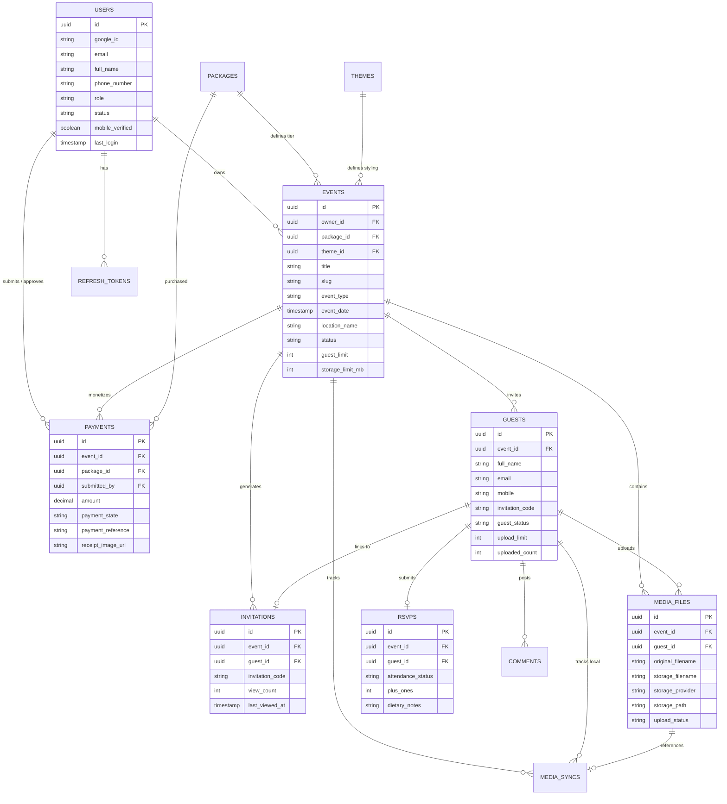

# Database Schema & Data Flow

## 1. Entity Relationship Diagram (ERD)

---

## 2. Database Migrations (Flyway Audit Log)

Database schema evolution is managed deterministically via Flyway migration scripts in `backend/src/main/resources/db/migration`:

| Version | Migration Script | Description | Key Changes |
|---|---|---|---|
| `V1` | `V1__create_users_table.sql` | Users Core Schema | Creates `users` table with UUID primary key, `google_id`, `email`, `role`, `status`, `mobile_verified`. |
| `V2` | `V2__create_packages_and_themes.sql` | Pricing & Customization | Creates `packages` (Free, Standard, VIP) and `themes` tables with default seed data. |
| `V3` | `V3__create_events_table.sql` | Events Table | Creates `events` table linked to `users`, `packages`, `themes` with `slug` index. |
| `V4` | `V4__create_guests_table.sql` | Guests Table | Creates `guests` table with `invitation_code` unique constraint and upload quota counters. |
| `V5` | `V5__create_invitations_table.sql` | Public Invitations | Creates `invitations` table tracking invitation URL visits and view timestamps. |
| `V6` | `V6__create_rsvp_table.sql` | RSVP Submissions | Creates `rsvps` table capturing attendance response, plus-ones, and dietary restrictions. |
| `V7` | `V7__create_comments_table.sql` | Guest Wishes Wall | Creates `comments` table for guest wall messages with moderation status. |
| `V8` | `V8__create_media_files_table.sql` | Media Metadata | Creates `media_files` table recording file size, MIME type, storage provider, and upload status. |
| `V9` | `V9__create_media_sync_table.sql` | Offline Upload Deduplication | Creates `media_sync` table recording `local_identifier` for offline queue sync idempotency. |
| `V10` | `V10__create_notifications_table.sql` | Notification Queue | Creates `notifications` table for dispatch tracking across SMS, Email, and Push channels. |
| `V11` | `V11__create_payments_table.sql` | Payment Receipts & Monetization | Creates `payments` table storing payment references, amount, state, and receipt upload URLs. |
| `V12` | `V12__create_storage_providers_table.sql` | Storage Credentials Config | Creates `storage_connections` configuration table. |
| `V13` | `V13__seed_default_data.sql` | Default Data Seeding | Seeds initial packages, admin user, and platform default themes. |
| `V14` | `V14__rename_storage_providers...sql` | Storage Renaming Patch | Refactors storage provider configuration naming conventions. |
| `V15` | `V15__add_operational_metadata...sql` | Media Sync Metadata Patch | Adds operational tracking fields to `media_sync` table. |

---

## 3. Transaction Management & Persistence Boundary

1. **Transaction Scoping (`@Transactional`)**:
   - All state-altering service methods (e.g., `createEvent`, `uploadMedia`, `approvePayment`) are annotated with `@Transactional`.
   - Read-only service operations use `@Transactional(readOnly = true)` to optimize database connection usage and flush mode settings.
2. **Transaction Rollback Protection & Cleanup**:
   - If an exception occurs during a database transaction, Spring rolls back all DB operations.
   - For file uploads in `MediaService`, if the DB save fails *after* writing the file to disk, a `try-catch` block invokes `storageProvider.delete(uploadResult.storagePath())` to prevent orphaned files.
3. **Decoupled Asynchronous Side Effects**:
   - Side effects (sending emails, Google Drive sync, metrics recording) are decoupled via Spring domain events.
   - Event listeners use `@TransactionalEventListener(phase = TransactionPhase.AFTER_COMMIT)` combined with `@Async`, guaranteeing that side effects are triggered **only after** the database transaction has successfully committed to disk.
