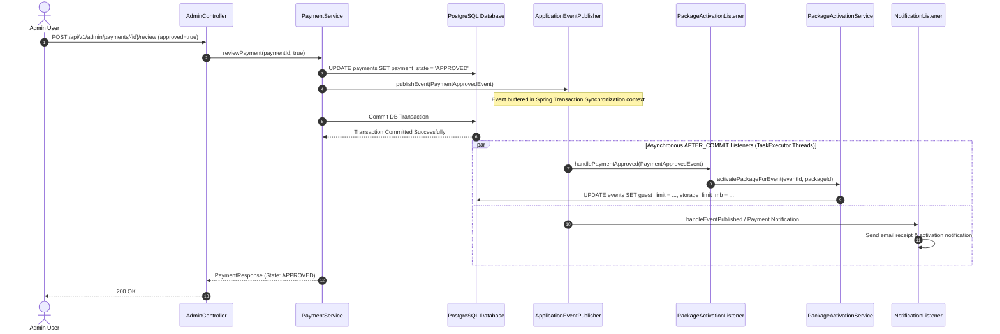

# Domain Event Pipeline & Asynchronous Execution Flow

## 1. Event-Driven Architecture Overview

The system utilizes Spring Framework's **in-memory event bus** (`ApplicationEventPublisher` and `@EventListener` / `@TransactionalEventListener`) to achieve clean separation of concerns and decouple database transactions from asynchronous side effects.

### Core Guarantees
1. **Transaction Integrity**: Primary HTTP request threads execute state-altering operations inside `@Transactional` database boundaries.
2. **Post-Commit Side Effects**: Listeners use `@TransactionalEventListener(phase = TransactionPhase.AFTER_COMMIT)` to guarantee that notifications, audit logging, analytics tracking, and storage sync execute **only after the database transaction has successfully committed**.
3. **Asynchronous Non-Blocking Execution**: Listeners are annotated with `@Async("taskExecutor")`, delegating execution to a managed thread pool (`AsyncConfig.java`) so that background operations never delay client HTTP responses.

---

## 2. Event Dispatch Sequence Diagram



---

## 3. Domain Event Catalog

| Domain Event Record | Triggering Service Method | Payload Attributes | Registered Listeners | Action Taken |
|---|---|---|---|---|
| `EventCreatedEvent` | `EventService.createEvent` | `eventId`, `ownerId`, `title`, `eventType`, `timestamp` | `AnalyticsListener`, `AuditListener` | Records platform event creation metrics and populates security audit logs. |
| `EventPublishedEvent` | `EventService.publishEvent` | `eventId`, `ownerId`, `slug`, `timestamp` | `StorageListener`, `AuditListener`, `NotificationListener` | Provisions Google Drive storage folder, audits status change, queues launch notifications. |
| `GuestAddedEvent` | `GuestService.addGuest` | `guestId`, `eventId`, `guestName`, `invitationCode` | `NotificationListener` | Prepares invitation link and queues SMS/Email invitation dispatch. |
| `InvitationViewedEvent` | `InvitationService.getInvitationBySlug` | `invitationId`, `guestId`, `timestamp` | `AnalyticsListener` | Updates real-time view counters and analytics conversion metrics. |
| `RSVPSubmittedEvent` | `RsvpService.submitRsvp` | `rsvpId`, `eventId`, `guestId`, `attendanceStatus` | `NotificationListener` | Triggers push/email notification to event owner reporting new guest response. |
| `CommentAddedEvent` | `CommentService.addComment` | `commentId`, `eventId`, `guestId` | `AnalyticsListener` | Updates event activity timeline and guest interaction counts. |
| `MediaUploadedEvent` | `MediaService.uploadMedia` | `mediaFileId`, `eventId`, `guestId`, `filename`, `fileSize` | `StorageListener`, `AnalyticsListener`, `AuditListener`, `NotificationListener` | Initiates Google Drive background cloud sync, updates storage metrics, notifies owner. |
| `PaymentApprovedEvent` | `PaymentService.reviewPayment` | `paymentId`, `eventId`, `packageId`, `adminUserId` | `PackageActivationListener` | Executes `PackageActivationService` to upgrade event quotas and limits automatically. |

---

## 4. Listener Thread Pool & Execution Policy (`AsyncConfig.java`)

```java
@Configuration
@EnableAsync
public class AsyncConfig implements AsyncConfigurer {

    @Override
    @Bean(name = "taskExecutor")
    public Executor getAsyncExecutor() {
        ThreadPoolTaskExecutor executor = new ThreadPoolTaskExecutor();
        executor.setCorePoolSize(5);
        executor.setMaxPoolSize(20);
        executor.setQueueCapacity(100);
        executor.setThreadNamePrefix("HImpact-Async-");
        executor.initialize();
        return executor;
    }
}
```

- **Core Pool Size**: 5 concurrent worker threads.
- **Max Pool Size**: 20 worker threads for peak notification/upload bursts.
- **Queue Capacity**: 100 queued events before triggering task rejection policy.
- **Thread Prefix**: `HImpact-Async-` for logging clarity in MDC.
