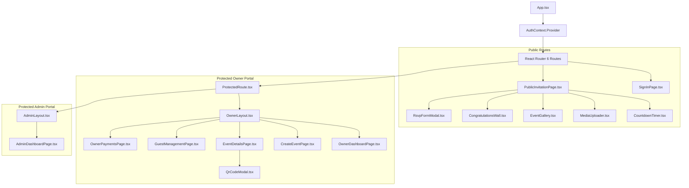

# Frontend Component & State Map

## 1. Directory & Module Structure

The frontend application is built using **React 18**, **TypeScript**, **Vite**, and **Tailwind CSS**. The source code is organized under `frontend/src`:

```
frontend/src
├── App.tsx                     # React Router 6 Configuration & Auth Provider Tree
├── main.tsx                    # React Root Hydration & Entry Point
├── index.css                   # Global Tailwind Styles & Design System Tokens
├── components/                 # Reusable UI Components & Modals
│   ├── CongratulationsWall.tsx # Public Wall for Guest Wishes & Comments
│   ├── CountdownTimer.tsx      # Interactive Event Countdown Counter
│   ├── EventGallery.tsx        # Responsive Photo/Video Grid with Lightbox
│   ├── MediaUploader.tsx       # Drag-and-Drop File Upload Component
│   ├── ProtectedRoute.tsx      # Role-Based Route Guard Wrapper
│   ├── QrCodeModal.tsx         # Modal display for Event QR Code
│   └── RsvpFormModal.tsx       # Interactive Guest RSVP Submission Modal
├── contexts/                   # Global React Contexts
│   └── AuthContext.tsx         # User Authentication State, JWT Decode, Login/Logout
├── layouts/                    # Application Shell Layouts
│   ├── AdminLayout.tsx         # Admin Navigation Sidebar & Topbar Shell
│   └── OwnerLayout.tsx         # Event Owner Navigation Shell & Package Banner
├── pages/                      # Page Components (Routed)
│   ├── admin/
│   │   └── AdminDashboardPage.tsx  # System Metrics, Approvals, Flags Overview
│   ├── auth/
│   │   ├── SignInPage.tsx          # Google Identity Services OAuth Login
│   │   └── PhoneVerificationPage.tsx # Mobile Phone OTP Verification Step
│   ├── error/
│   │   ├── NotFoundPage.tsx        # 404 Route Handler
│   │   └── UnauthorizedPage.tsx    # 403 Forbidden Access Page
│   ├── owner/
│   │   ├── CreateEventPage.tsx     # Multi-step Event Creation Form Wizard
│   │   ├── EventDetailsPage.tsx    # Event Settings, Storage Usage & Status
│   │   ├── GuestManagementPage.tsx # Guest List, Bulk CSV Import, Status Table
│   │   ├── OwnerDashboardPage.tsx  # Active Events Summary & Quick Actions
│   │   └── OwnerPaymentsPage.tsx   # Package Selection & Payment Receipt Upload
│   └── public/
│       └── PublicInvitationPage.tsx # Dynamic Public Guest Invitation Landing Page
├── services/                   # Modular API Client Services (Axios)
│   ├── apiClient.ts            # Base Axios Instance & Interceptors
│   ├── adminService.ts         # Admin REST API Calls
│   ├── authService.ts          # Auth REST API Calls
│   ├── commentService.ts       # Comment REST API Calls
│   ├── eventService.ts         # Event REST API Calls
│   ├── guestService.ts         # Guest REST API Calls
│   ├── invitationService.ts    # Invitation REST API Calls
│   ├── mediaService.ts         # Media REST API Calls
│   ├── paymentService.ts       # Payment REST API Calls
│   └── rsvpService.ts          # RSVP REST API Calls
├── types/                      # TypeScript Interface & Enum Definitions
└── utils/                      # Helper Functions (Date Formatters, Validators)
```

---

## 2. Routing & Navigation Tree

Routing is declared in `App.tsx` using `react-router-dom`:

| Path | Access Level | Component | Description |
|---|---|---|---|
| `/` | Public | `<Navigate to="/sign-in" />` | Root redirect to login page. |
| `/sign-in` | Public | `SignInPage` | Google Sign-In button and platform branding. |
| `/invite/:slug` | Public | `PublicInvitationPage` | Public invitation card, RSVP form modal, media uploader, gallery, and guest wall. |
| `/unauthorized` | Public | `UnauthorizedPage` | Displayed when user lacks necessary role permissions. |
| `*` | Public | `NotFoundPage` | Catch-all 404 page. |
| `/verify-phone` | Protected (Authenticated) | `PhoneVerificationPage` | Post-login SMS/Phone verification step. |
| `/owner` | Protected (`OWNER`, `ADMIN`, `SUPER_ADMIN`) | `OwnerLayout` -> `OwnerDashboardPage` | Owner dashboard displaying event cards and quick metrics. |
| `/owner/events/new` | Protected (`OWNER`, `ADMIN`, `SUPER_ADMIN`) | `OwnerLayout` -> `CreateEventPage` | Event wizard (Title, Date, Location, Package, Theme). |
| `/owner/events/:id` | Protected (`OWNER`, `ADMIN`, `SUPER_ADMIN`) | `OwnerLayout` -> `EventDetailsPage` | Event management, status changes, storage stats, QR modal. |
| `/owner/events/:id/guests` | Protected (`OWNER`, `ADMIN`, `SUPER_ADMIN`) | `OwnerLayout` -> `GuestManagementPage` | Guest table, single guest addition, CSV bulk import. |
| `/owner/payments` | Protected (`OWNER`, `ADMIN`, `SUPER_ADMIN`) | `OwnerLayout` -> `OwnerPaymentsPage` | Package upgrading, Instapay/Vodafone Cash receipt submission. |
| `/admin` | Protected (`ADMIN`, `SUPER_ADMIN`, `FINANCE`, `SUPPORT`) | `AdminLayout` -> `AdminDashboardPage` | System dashboard, pending payment reviews, feature flag toggles. |

---

## 3. State Management & API Interceptor Chain

### Authentication State Flow (`AuthContext.tsx`)
1. On app mount, `AuthContext` checks `localStorage` for `accessToken`.
2. If token exists and `exp` timestamp is valid, parses claims (`sub`, `email`, `role`, `mobileVerified`) and sets `user` state.
3. On login, stores `accessToken` and `refreshToken` in `localStorage` and updates user context.
4. On logout, clears tokens from `localStorage` and resets user state to `null`.

### Axios HTTP Interceptor Pipeline (`apiClient.ts`)
- **Request Interceptor**: Automatically attaches `Authorization: Bearer <accessToken>` header to every outgoing HTTP request.
- **Response Interceptor**:
  - Automatically intercepts HTTP `401 Unauthorized` responses.
  - Clears `accessToken` and `refreshToken` from `localStorage`.
  - Performs an immediate hard redirect to `/sign-in` (`window.location.replace('/sign-in')`).

---

## 4. Component Hierarchy Diagram


