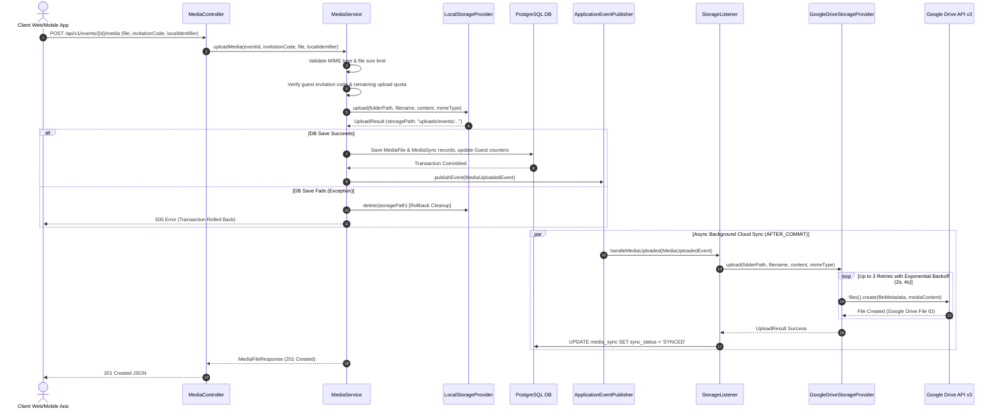
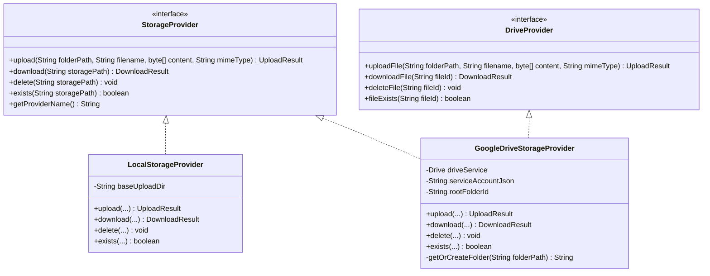

# Media Upload, Storage Provider & Offline Sync Pipeline

## 1. Media Pipeline Overview

The **Media Management Subsystem** handles guest photo and video uploads, enforcing file format security, guest quota limits, local disk storage, transaction-rollback file cleanup, and background cloud synchronization to **Google Drive**.

### Key Architectural Capabilities
- **Server-Side MIME & Size Validation**: Accepts `JPG`, `PNG`, `WEBP`, `HEIC` (max 20MB) and `MP4`, `MOV` (max 200MB).
- **Dual-Storage Provider Pattern**: Immediate local disk write (`LocalStorageProvider`) for zero-latency response, followed by asynchronous cloud backup (`GoogleDriveStorageProvider`).
- **Transaction Rollback Protection**: If the database save fails after storing a file on disk, `MediaService` automatically deletes the file from disk to prevent storage leaks.
- **Offline Queue Deduplication**: Public clients upload offline queues with a `localIdentifier`. Idempotent `MediaSync` records prevent duplicate file processing upon reconnection.

---

## 2. Media Upload & Storage Sync Sequence Diagram

---

## 3. Storage Provider Architecture

---

## 4. Offline Queue & Idempotent Synchronization (`SyncMediaRequest`)

When a mobile or web client records media while offline, it queues the files locally with a generated `localIdentifier` (e.g. `client_uuid_12345`).

Upon reconnecting, the client calls `POST /api/v1/events/{id}/media/sync`:
1. `MediaService` queries `MediaSyncRepository` by `guestId` and `localIdentifier`.
2. If a record exists with `SyncStatus.COMPLETED`, the service bypasses processing and immediately returns the existing `MediaFileResponse`.
3. If no record exists, a new `MediaSync` record is created in state `PENDING`, allowing the client to proceed with uploading the payload without creating duplicates.
