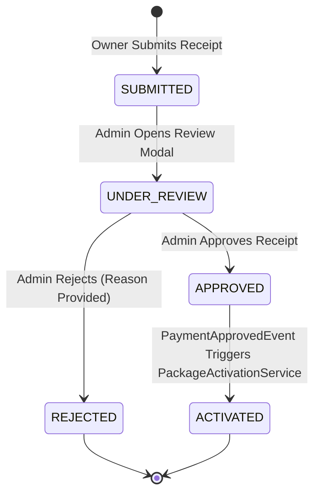
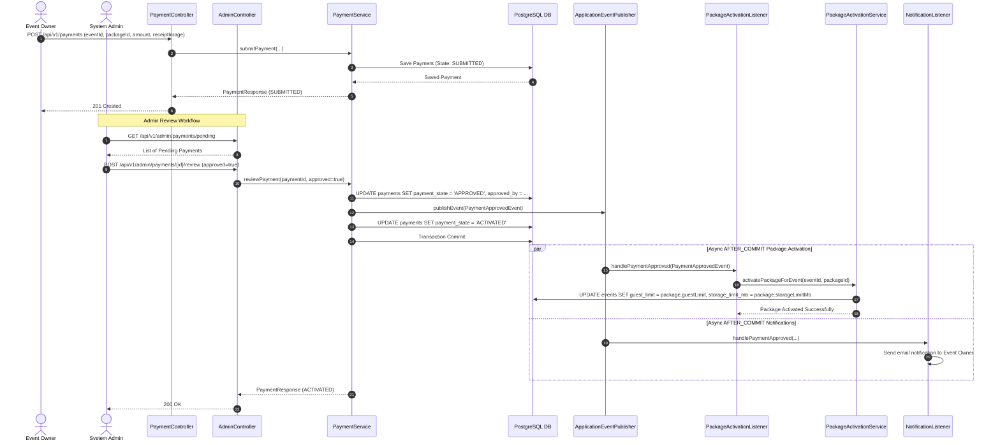

# Payment Processing & Package Activation Flow

## 1. Monetization & Payment Architecture

The platform supports digital event package monetization (Free, Standard, VIP). Event owners can upgrade their event tier by submitting payment proof (Instapay / Vodafone Cash transaction receipts).

### Key Architectural Requirements
- **Decoupled Package Activation**: Payment approval and package activation are strictly decoupled. When an admin approves a payment, `PaymentService` emits a `PaymentApprovedEvent`.
- **Async Event Listener Execution**: `PackageActivationListener` receives `PaymentApprovedEvent` `AFTER_COMMIT` and invokes `PackageActivationService` to upgrade event guest limits, upload limits, and storage quotas automatically.
- **State Machine Integrity**: Payments transition through strict states (`SUBMITTED` -> `UNDER_REVIEW` -> `APPROVED` / `REJECTED` -> `ACTIVATED`).

---

## 2. Payment State Transition Diagram

---

## 3. End-to-End Payment & Activation Sequence Diagram

---

## 4. Package Quotas & Feature Tiers

| Package Tier | Guest Limit | Storage Limit (MB) | Media Upload Quota / Guest | Theme Options |
|---|---|---|---|---|
| **Free** | 50 | 500 MB | 5 photos | Default Theme |
| **Standard** | 200 | 5,000 MB (5 GB) | 20 photos / 2 videos | Standard Themes |
| **VIP** | 1,000 | 50,000 MB (50 GB) | Unlimited | Premium Customized Themes |
