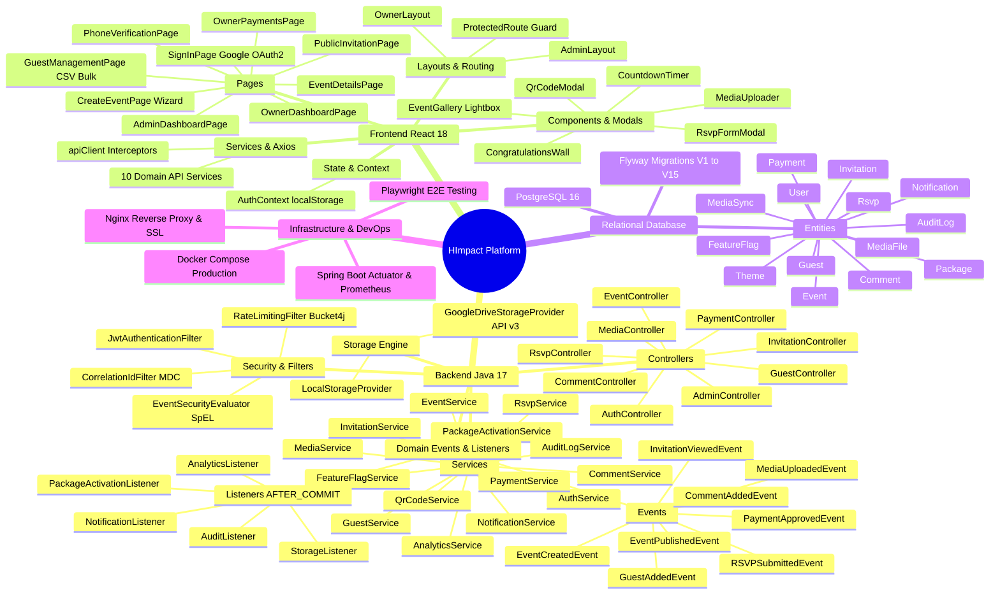

# Complete System Mind Map

```mermaid
mindmap
  root((HImpact Platform))
    Backend Java 17
      Security & Filters
        JwtAuthenticationFilter
        CorrelationIdFilter MDC
        RateLimitingFilter Bucket4j
        EventSecurityEvaluator SpEL
      Controllers
        AuthController
        EventController
        GuestController
        InvitationController
        MediaController
        PaymentController
        RsvpController
        CommentController
        AdminController
      Services
        AuthService
        EventService
        GuestService
        MediaService
        PaymentService
        PackageActivationService
        RsvpService
        InvitationService
        CommentService
        NotificationService
        AnalyticsService
        AuditLogService
        FeatureFlagService
        QrCodeService
      Domain Events & Listeners
        Events
          EventCreatedEvent
          EventPublishedEvent
          GuestAddedEvent
          InvitationViewedEvent
          RSVPSubmittedEvent
          CommentAddedEvent
          MediaUploadedEvent
          PaymentApprovedEvent
        Listeners AFTER_COMMIT
          AnalyticsListener
          AuditListener
          NotificationListener
          PackageActivationListener
          StorageListener
      Storage Engine
        LocalStorageProvider
        GoogleDriveStorageProvider API v3
    Frontend React 18
      Layouts & Routing
        OwnerLayout
        AdminLayout
        ProtectedRoute Guard
      Pages
        SignInPage Google OAuth2
        PhoneVerificationPage
        OwnerDashboardPage
        CreateEventPage Wizard
        EventDetailsPage
        GuestManagementPage CSV Bulk
        OwnerPaymentsPage
        AdminDashboardPage
        PublicInvitationPage
      Components & Modals
        CountdownTimer
        EventGallery Lightbox
        MediaUploader
        CongratulationsWall
        QrCodeModal
        RsvpFormModal
      Services & Axios
        apiClient Interceptors
        10 Domain API Services
      State & Context
        AuthContext localStorage
    Relational Database
      PostgreSQL 16
      Flyway Migrations V1 to V15
      Entities
        User
        Event
        Guest
        Invitation
        Rsvp
        Comment
        MediaFile
        MediaSync
        Payment
        Package
        Theme
        Notification
        AuditLog
        FeatureFlag
    Infrastructure & DevOps
      Docker Compose Production
      Nginx Reverse Proxy & SSL
      Spring Boot Actuator & Prometheus
      Playwright E2E Testing
```
