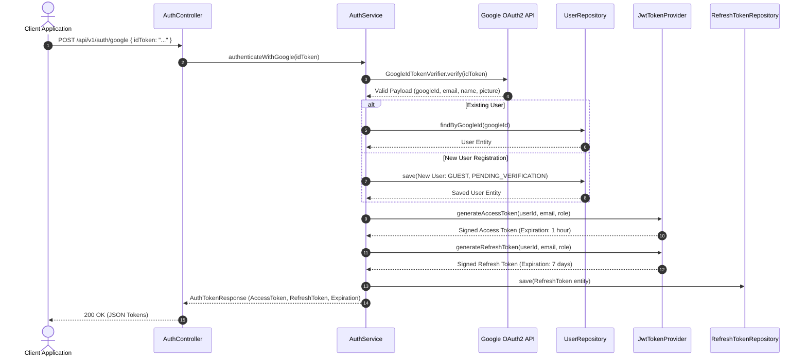
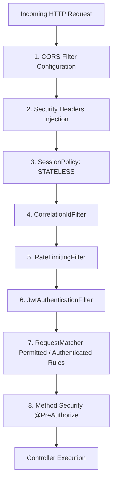

# Security Architecture & Authorization Flow

## 1. Security Overview

**HImpact Digital Event Automation** implements a zero-trust, stateless authentication and authorization architecture combining **Google OAuth2 Federated Authentication**, **HMAC-SHA256 Signed JWT Tokens**, **Database-Backed Refresh Token Rotation**, and **Fine-Grained Method Security** (`EventSecurityEvaluator`).

---

## 2. Authentication Sequence Diagram



---

## 3. Spring Security Filter Chain Pipeline

Every HTTP request passing through the backend application traverses the `SecurityFilterChain` declared in `SecurityConfig.java`:



### Key Security Filters
1. **`CorrelationIdFilter`**:
   - Checks request for header `X-Correlation-ID`.
   - Generates a UUID if missing and sets it in SLF4J MDC context (`MDC.put("correlationId", ...)`).
   - Injects `X-Correlation-ID` header into HTTP response.
2. **`RateLimitingFilter`**:
   - Uses Bucket4j to limit request bursts by IP address on public routes.
   - Rejects excess requests with HTTP `429 Too Many Requests`.
3. **`JwtAuthenticationFilter`**:
   - Intercepts requests containing `Authorization: Bearer <token>`.
   - Validates JWT signature and expiration via `JwtTokenProvider`.
   - Constructs `HimpactUserPrincipal` and populates `SecurityContextHolder.getContext().setAuthentication(...)`.

---

## 4. Role-Based Access Control (RBAC) Matrix

| User Role | Permissions & Scope |
|---|---|
| `ADMIN` / `SUPER_ADMIN` | Global platform access. Can view all events, manage feature flags, review and approve payment receipts, override guest limits, and access actuator metrics. |
| `EVENT_OWNER` | Event owner portal access. Can create events, configure themes, manage guest lists, trigger CSV imports, view event media, purchase package upgrades, and view RSVP statistics. Can only access events where `event.owner.id == user.id`. |
| `GUEST` | Invitation access. Can view public event invitation page, submit RSVP, view event gallery, upload event photos/videos, and post wall messages. Restricted by `invitationCode`. |

---

## 5. Fine-Grained Method Security (`EventSecurityEvaluator`)

Resource access isolation is enforced declaratively at the controller method level via custom Spring Security SpEL expressions:

```java
@PreAuthorize("@eventSecurity.isOwner(#eventId)")
@GetMapping("/api/v1/events/{eventId}")
public ResponseEntity<EventResponse> getEvent(@PathVariable UUID eventId) { ... }
```

### Security Expression Methods (`@eventSecurity`)
- **`isOwner(UUID eventId)`**:
  1. Checks if current principal has `ADMIN` role (returns `true`).
  2. Otherwise queries `EventRepository` to verify if `event.owner.id` matches the authenticated `principal.userId()`.
- **`isGuestOrOwner(UUID eventId)`**:
  1. Grants access to `ADMIN` or the event owner.
  2. Queries `GuestRepository` to check if `guest.email` or `guest.mobile` matches the authenticated principal for the specified `eventId`.
