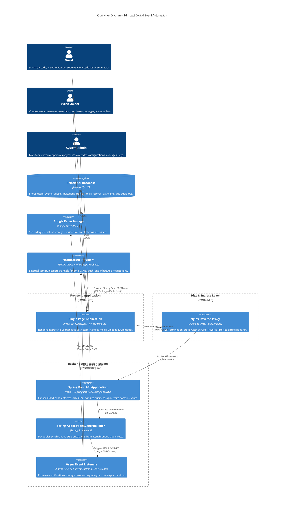

# System Architecture Specification

## 1. System Overview

**HImpact Digital Event Automation** is an enterprise-grade digital event management and automation platform designed to streamline guest invitations, RSVP management, real-time photo/video collection, package monetization, and automated guest notifications.

The application follows a **Decoupled Layered Micro-Monolith Architecture** with an event-driven background processing pipeline for side effects.

---

## 2. High-Level C4 Container Diagram



---

## 3. Deployment Diagram

```mermaid
deploymentDiagram
    node "Client Device" {
        component [Web Browser / Mobile Web] as Browser
    }

    node "Docker Host / Container Platform" {
        node "Container: nginx-proxy" {
            component [Nginx (Port 80/443)] as Nginx
        }

        node "Container: himpact-backend" {
            component [Spring Boot Service (Port 8080)] as Backend
        }

        node "Container: postgres-db" {
            database "PostgreSQL Database (Port 5432)" as Postgres
        }
    }

    node "Cloud & External Services" {
        component [Google OAuth2 Service] as GoogleAuth
        component [Google Drive Cloud Storage] as GoogleDrive
        component [SMTP Mail Server] as SmtpServer
    }

    Browser --> Nginx : HTTPS (Port 443)
    Nginx --> Backend : HTTP (Port 8080)
    Backend --> Postgres : JDBC / PostgreSQL (Port 5432)
    Backend --> GoogleAuth : OAuth2 Token Verification
    Backend --> GoogleDrive : Google Drive API v3
    Backend --> SmtpServer : SMTP (Port 587)
```

---

## 4. Architectural Layers & Responsibilities

| Layer | Primary Tech Stack | Responsibilities |
|---|---|---|
| **Presentation Layer (Frontend)** | React 18, TypeScript, Vite, Tailwind CSS, Axios | User interface rendering, client-side routing (`react-router-dom`), state management (`AuthContext`), JWT storage in `localStorage`, media upload handling. |
| **Ingress & Gateway Layer** | Nginx Reverse Proxy, Docker | SSL termination, reverse proxy routing (`/api/v1` -> Spring Boot), CORS headers, edge rate limiting, serving production static web builds. |
| **Security & Filter Chain** | Spring Security 6.x, JJWT, Bucket4j | MDC Correlation ID tracking (`CorrelationIdFilter`), IP rate limiting (`RateLimitingFilter`), JWT extraction & authentication (`JwtAuthenticationFilter`), method security (`EventSecurityEvaluator`). |
| **Controller Layer (REST)** | Spring WebMVC (`@RestController`) | Endpoint exposed contracts, HTTP request validation (`@Valid`), delegation to business services, DTO mapping. |
| **Service Layer (Domain Logic)** | Spring Service (`@Service`), `@Transactional` | Core business rules, quota checking, transaction boundaries, publishing Spring `ApplicationEventPublisher` domain events. |
| **Event Pipeline Layer** | Spring `@TransactionalEventListener`, `@Async` | Asynchronous decoupled execution of post-transaction tasks (notifications, media storage sync, package activation, audit logging). |
| **Persistence Layer** | Spring Data JPA, Hibernate, PostgreSQL 16 | Relational data persistence, soft deletes (`is_deleted`), query optimization, transaction management. |
| **Database Migration** | Flyway Migration Engine | Versioned DDL and DML migration scripts (`V1__` to `V15__`), ensuring schema consistency across environments. |
| **Storage Layer** | Dual-Provider Strategy (`LocalStorageProvider`, `GoogleDriveStorageProvider`) | Local disk storage with automatic background synchronization to Google Drive via Google Service Account authentication. |

---

## 5. Cross-Cutting Concerns

1. **Request Correlation (`CorrelationIdFilter` & MDC)**:
   - Every incoming HTTP request is assigned a unique `X-Correlation-ID` header (or preserves the client-provided header).
   - Injected into SLF4J MDC context so all log messages across threads share the exact request trace ID.
2. **IP-Based Rate Limiting (`RateLimitingFilter`)**:
   - Protects public authentication and upload endpoints against brute-force attacks.
   - Enforces a bucket-refill strategy limiting request bursts per IP address.
3. **Transaction Boundaries & AFTER_COMMIT Event Guarantee**:
   - State-modifying operations execute within synchronous `@Transactional` methods.
   - Side effects (emails, push notifications, storage synchronization) execute asynchronously **only after** `TransactionPhase.AFTER_COMMIT` is reached.
